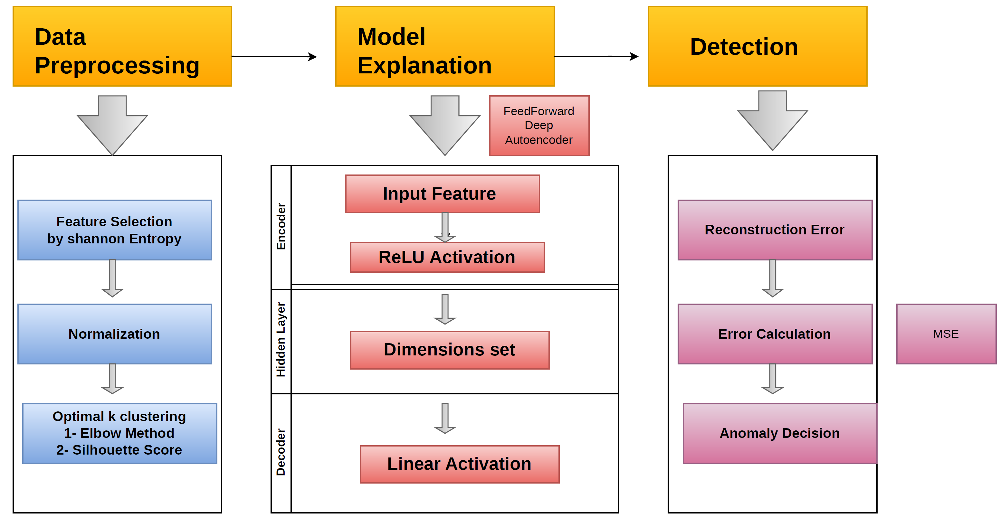

Unsupervised-Deep-Learn-for-5G-Resources-Allocation-Network-Analysis

### Problem Statement
In 5G networks, the connection quality changes constantly. When mobile signals are weak (like -120 dBm to -100 dBm), phones often struggle, lose data packets, and end up requesting more bandwidth just to keep working. When signals are strong (like -60 dBm to -40 dBm), connections are clean and efficient. 
The challenge is figuring out when the network is acting weird or unfair like when a phone is getting the wrong amount of bandwidth for its signal strength. This project solves that by using an AI autoencoder trained on normal network patterns. The AI learns what normal operations look like so 
it can automatically spot and flag unusual resource allocation problems.

## 📐 Pipeline Architecture

---

## 🛠️ Data Preprocessing
* **Feature Extraction & Selection:** Guided by domain knowledge and Shannon entropy, high-entropy features (`Signal_Strength`, `Required_Bandwidth`, and `Allocated_Bandwidth`) were selected while dropping unnecessary identifiers[cite: 1].
* **Data Cleaning:** Converted numerical columns from string formats (e.g., removing `dBm`, `Mbps`, `%`) into proper float formats for mathematical processing[cite: 1].
* **Normalization:** Applied `StandardScaler` to scale the selected features, ensuring the autoencoder processes balanced inputs[cite: 1].

---

## 🤖 Model Architecture & Training
* **Baseline Clustering:** Utilized K-Means clustering ($K=3$, determined via the Elbow Method and Silhouette scores) to segment network states, using Cluster 1 as the normal baseline[cite: 1].
* **FeedForward Autoencoder:** Trained exclusively on normal network patterns (Cluster 1) to learn efficient data reconstruction.
* **Decoder Activation:** We recommend using a **Linear activation** instead of **Sigmoid**. Why? Because we scaled our data using `StandardScaler`, which creates negative numbers. Since Sigmoid only works for values between 0 and 1, it would clip our negative values. Linear activation lets the model output any number without cutting off our negative data!

---

## 📊 Model Performance
* **Accuracy (98%):** 
* **Precision (90%):** 
* **Recall (97%):** 
* **F1-Score (93%):**
Performance Summary: The model achieves 98% accuracy in mapping correct bandwidth distributions alongside a 90% precision and 97% recall, resulting in a 93% F1-score that effectively minimizes false alarms while catching real anomalies.

Practical Impact: This balanced performance allows the autoencoder to reliably identify when a network behaves unfairly by assigning the wrong bandwidth for a given signal strength.
---

## 📚 Publication & Article
* Want to read more about how we built this? Check out the full article here: [Insert Your Article Link Here]
